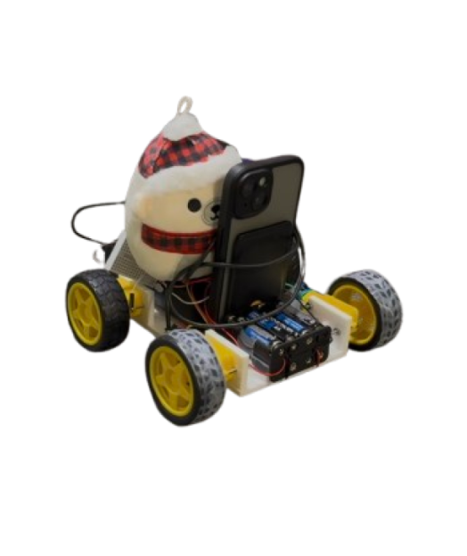

# Voice-Controlled Wheelchair

**Code for a voice-controlled wheelchair with autonomous hazard detection**
Using machine learning models for voice recognition and visual detection

## Acknowledgments

**VOSK**

This project uses the Vosk speech recognition model.
Vosk is licensed under the Apache License 2.0.
For more information, visit: https://alphacephei.com/vosk/

**LiDAR**

This project is equipped with the feature of LiDAR mapping shown above, which utilizes the [YDLIDAR SDK](https://github.com/YDLIDAR/YDLidar-SDK), which is licensed under the MIT License. We thank the YDLIDAR team for providing this valuable resource.
